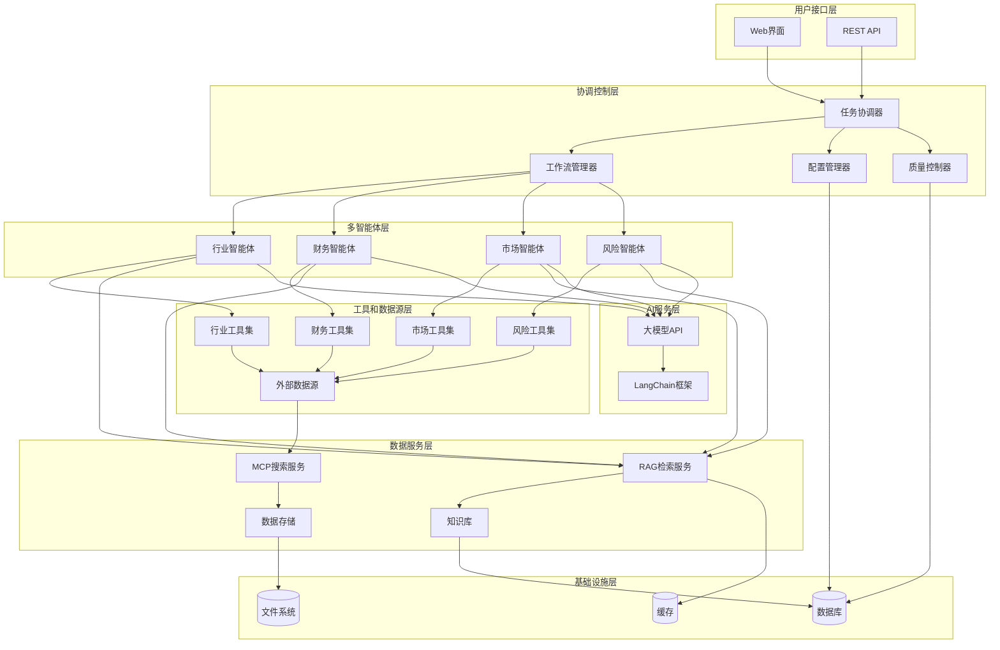
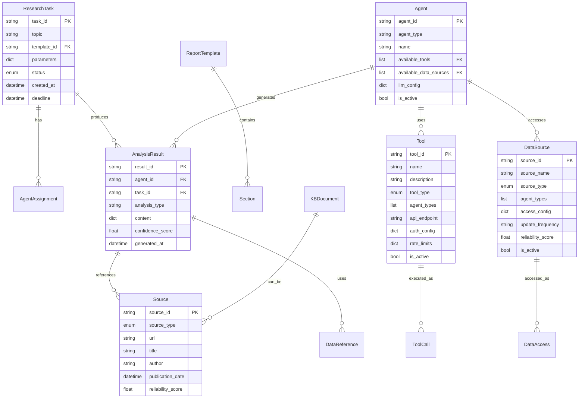

# 投行研究报告深度研究系统设计文档

## 概述

投行研究报告深度研究系统（DeepResearch）是一个基于多智能体协作的AI驱动研究平台。系统采用LangChain框架构建，集成MCP搜索协议和RAG技术，通过专业化智能体的独立分析和统一汇总，生成高质量、可溯源的投资银行研究报告。

### 核心设计原则

1. **专业化分工**: 不同智能体专注特定领域，确保分析的专业性和深度
2. **独立分析**: 各智能体基于相同数据源独立工作，避免相互干扰
3. **统一汇总**: 通过标准化流程整合各智能体结果，确保连贯性
4. **可溯源性**: 所有分析内容都有明确的数据来源和推理路径
5. **模板化**: 支持多种报告模板，满足不同研究需求

## 架构

### 系统架构图



### 分层架构说明

1. **用户接口层**: 提供Web界面和REST API，支持用户交互和系统集成
2. **协调控制层**: 负责任务分配、工作流管理和质量控制
3. **多智能体层**: 四个专业化智能体独立执行分析任务
4. **数据服务层**: 提供数据获取、检索和存储服务
5. **AI服务层**: 集成大模型API和LangChain框架
6. **基础设施层**: 提供数据持久化和缓存支持

## 组件和接口

### 核心组件

#### 1. 任务协调器 (Task Coordinator)

**职责**: 
- 接收用户研究请求
- 分解任务并分配给各智能体
- 协调智能体工作流程
- 汇总分析结果

**接口**:
```python
class TaskCoordinator:
    def create_research_task(self, topic: str, template: str, params: dict) -> TaskID
    def assign_agents(self, task_id: TaskID) -> List[AgentAssignment]
    def collect_results(self, task_id: TaskID) -> List[AgentResult]
    def synthesize_report(self, results: List[AgentResult]) -> Report
```

#### 2. 专业智能体 (Specialized Agents)

**行业智能体 (Industry Agent)**:
- **职责**: 行业趋势分析、竞争格局评估、监管环境分析
- **可用工具**:
  - 行业报告检索工具
  - 监管文件搜索工具
  - 竞争对手分析工具
  - 行业新闻聚合工具
- **数据源**:
  - 行业研究报告数据库
  - 监管机构公告
  - 行业协会发布的统计数据
  - 专业媒体和新闻源
  - 公司年报和季报

**财务智能体 (Financial Agent)**:
- **职责**: 财务数据分析、估值模型构建、财务预测
- **可用工具**:
  - 财务数据API接口
  - 估值模型计算器
  - 财务比率分析工具
  - 现金流预测工具
  - 风险调整收益计算工具
- **数据源**:
  - Bloomberg/Reuters财务数据
  - 公司财务报表
  - 股价和交易数据
  - 债券和信用评级数据
  - 宏观经济指标

**市场智能体 (Market Agent)**:
- **职责**: 市场规模评估、需求分析、价格趋势预测
- **可用工具**:
  - 市场调研数据检索工具
  - 消费者行为分析工具
  - 价格趋势分析工具
  - 市场份额计算工具
  - 地理市场分析工具
- **数据源**:
  - 市场调研报告
  - 消费者调查数据
  - 电商平台销售数据
  - 社交媒体情感分析
  - 地理和人口统计数据

**风险智能体 (Risk Agent)**:
- **职责**: 风险识别和评估、合规性检查、风险缓解建议
- **可用工具**:
  - 风险评估模型
  - 合规性检查工具
  - 信用风险分析工具
  - 市场风险计算器
  - 操作风险评估工具
- **数据源**:
  - 监管合规数据库
  - 信用评级机构数据
  - 历史风险事件数据
  - 法律法规数据库
  - 审计报告和合规报告

**通用智能体接口**:
```python
class BaseAgent:
    def __init__(self, tools: List[Tool], data_sources: List[DataSource]):
        self.tools = tools
        self.data_sources = data_sources
    
    def analyze(self, data: DataSet, context: AnalysisContext) -> AnalysisResult
    def validate_data(self, data: DataSet) -> ValidationResult
    def generate_insights(self, analysis: AnalysisResult) -> List[Insight]
    def get_available_tools(self) -> List[Tool]
    def get_data_sources(self) -> List[DataSource]
```

**工具和数据源配置接口**:
```python
class Tool:
    name: str
    description: str
    api_endpoint: str
    authentication: AuthConfig
    rate_limits: RateLimit
    
class DataSource:
    source_id: str
    source_name: str
    source_type: SourceType  # API, Database, File, Web
    access_config: AccessConfig
    update_frequency: str
    reliability_score: float
```

#### 3. RAG检索服务 (RAG Retrieval Service)

**职责**:
- 从知识库检索相关信息
- 增强智能体分析能力
- 提供溯源信息

**接口**:
```python
class RAGService:
    def retrieve_context(self, query: str, domain: str) -> List[Document]
    def enhance_prompt(self, base_prompt: str, context: List[Document]) -> str
    def track_sources(self, documents: List[Document]) -> List[Source]
```

#### 4. MCP搜索服务 (MCP Search Service)

**职责**:
- 获取外部市场数据
- 实时信息更新
- 数据质量验证

**接口**:
```python
class MCPSearchService:
    def search_market_data(self, query: SearchQuery) -> MarketData
    def get_real_time_data(self, symbols: List[str]) -> RealTimeData
    def validate_data_quality(self, data: Any) -> QualityScore
```

### 数据流接口

#### 数据标准化接口
```python
class DataStandardizer:
    def normalize_financial_data(self, raw_data: dict) -> FinancialData
    def standardize_market_data(self, raw_data: dict) -> MarketData
    def validate_data_consistency(self, datasets: List[DataSet]) -> bool
```

#### 报告生成接口
```python
class ReportGenerator:
    def apply_template(self, template: Template, content: dict) -> Report
    def ensure_coherence(self, sections: List[Section]) -> Report
    def generate_citations(self, sources: List[Source]) -> List[Citation]
```

#### 5. 配置管理器 (Configuration Manager)

**职责**:
- 管理智能体工具配置
- 维护数据源访问配置
- 处理API密钥和认证
- 监控工具可用性和性能

**接口**:
```python
class ConfigurationManager:
    def register_tool(self, agent_type: str, tool: Tool) -> bool
    def register_data_source(self, agent_type: str, source: DataSource) -> bool
    def get_agent_tools(self, agent_type: str) -> List[Tool]
    def get_agent_data_sources(self, agent_type: str) -> List[DataSource]
    def validate_tool_access(self, tool: Tool) -> bool
    def update_tool_config(self, tool_id: str, config: dict) -> bool
```

#### 6. 工具抽象层 (Tool Abstraction Layer)

**职责**:
- 提供统一的工具调用接口
- 处理不同API的认证和限流
- 缓存和优化工具调用
- 监控工具使用情况

**接口**:
```python
class ToolManager:
    def call_tool(self, tool_name: str, parameters: dict) -> ToolResult
    def batch_call_tools(self, calls: List[ToolCall]) -> List[ToolResult]
    def get_tool_status(self, tool_name: str) -> ToolStatus
    def cache_tool_result(self, call: ToolCall, result: ToolResult) -> None
```

## 数据模型

### 核心数据结构

#### 研究任务 (Research Task)
```python
@dataclass
class ResearchTask:
    task_id: str
    topic: str
    template_id: str
    parameters: dict
    status: TaskStatus
    created_at: datetime
    deadline: datetime
    assigned_agents: List[str]
```

#### 智能体分析结果 (Agent Analysis Result)
```python
@dataclass
class AnalysisResult:
    agent_id: str
    task_id: str
    analysis_type: str
    content: dict
    confidence_score: float
    sources: List[Source]
    generated_at: datetime
    data_references: List[DataReference]
```

#### 数据源引用 (Data Source Reference)
```python
@dataclass
class Source:
    source_id: str
    source_type: SourceType  # MCP, RAG, Manual
    url: Optional[str]
    title: str
    author: Optional[str]
    publication_date: datetime
    access_date: datetime
    reliability_score: float
```

#### 报告模板 (Report Template)
```python
@dataclass
class ReportTemplate:
    template_id: str
    name: str
    description: str
    sections: List[Section]
    required_agents: List[str]
    output_format: OutputFormat
    style_guide: StyleGuide
```

#### 知识库文档 (Knowledge Base Document)
```python
@dataclass
class KBDocument:
    document_id: str
    title: str
    content: str
    document_type: DocumentType
    domain: str
    tags: List[str]
    embedding: List[float]
    last_updated: datetime
    quality_score: float
```

#### 工具配置 (Tool Configuration)
```python
@dataclass
class Tool:
    tool_id: str
    name: str
    description: str
    tool_type: ToolType  # API, Database, WebScraper, Calculator
    agent_types: List[str]  # 可使用此工具的智能体类型
    api_endpoint: Optional[str]
    authentication: AuthConfig
    rate_limits: RateLimit
    parameters_schema: dict
    is_active: bool
    last_health_check: datetime

@dataclass
class AuthConfig:
    auth_type: AuthType  # API_KEY, OAUTH, BASIC, NONE
    credentials: dict
    headers: Optional[dict]

@dataclass
class RateLimit:
    requests_per_minute: int
    requests_per_hour: int
    concurrent_requests: int
```

#### 数据源配置 (Data Source Configuration)
```python
@dataclass
class DataSource:
    source_id: str
    source_name: str
    source_type: SourceType  # API, Database, File, Web, RSS
    agent_types: List[str]  # 可访问此数据源的智能体类型
    access_config: AccessConfig
    update_frequency: str  # daily, hourly, real-time
    reliability_score: float
    data_schema: dict
    is_active: bool
    last_sync: datetime

@dataclass
class AccessConfig:
    connection_string: Optional[str]
    api_endpoint: Optional[str]
    file_path: Optional[str]
    authentication: AuthConfig
    timeout_seconds: int
```

#### 智能体配置 (Agent Configuration)
```python
@dataclass
class AgentConfig:
    agent_id: str
    agent_type: str  # industry, financial, market, risk
    name: str
    description: str
    available_tools: List[str]  # tool_ids
    available_data_sources: List[str]  # source_ids
    llm_config: LLMConfig
    prompt_templates: dict
    is_active: bool
    performance_metrics: dict

@dataclass
class LLMConfig:
    model_name: str
    api_endpoint: str
    max_tokens: int
    temperature: float
    timeout_seconds: int
```

### 数据关系模型



## 错误处理

### 错误分类和处理策略

#### 1. 数据获取错误
- **MCP搜索失败**: 重试机制 + 备用数据源
- **RAG检索异常**: 降级到基础知识库
- **数据质量问题**: 标记质量等级 + 用户提醒

#### 2. 智能体分析错误
- **API调用失败**: 指数退避重试
- **分析超时**: 任务分片 + 并行处理
- **结果质量低**: 重新生成 + 人工审核

#### 3. 汇总整合错误
- **数据冲突**: 冲突标记 + 优先级解决
- **连贯性问题**: 自动修正 + 质量检查
- **格式错误**: 模板验证 + 自动修复

### 错误处理流程

```python
class ErrorHandler:
    def handle_data_error(self, error: DataError) -> ErrorResponse:
        if error.is_recoverable():
            return self.retry_with_backoff(error.operation)
        else:
            return self.fallback_to_alternative(error.context)
    
    def handle_agent_error(self, error: AgentError) -> ErrorResponse:
        if error.is_timeout():
            return self.split_and_retry(error.task)
        elif error.is_quality_issue():
            return self.regenerate_with_constraints(error.parameters)
    
    def handle_synthesis_error(self, error: SynthesisError) -> ErrorResponse:
        if error.is_conflict():
            return self.resolve_conflict(error.conflicting_data)
        elif error.is_coherence_issue():
            return self.apply_coherence_rules(error.content)
```

## 测试策略

### 单元测试

**智能体测试**:
- 各智能体独立分析功能
- 数据处理和验证逻辑
- 错误处理和恢复机制

**服务组件测试**:
- RAG检索准确性
- MCP搜索功能
- 数据标准化逻辑

**工具函数测试**:
- 数据转换和格式化
- 模板应用和渲染
- 引用生成和管理

### 集成测试

**多智能体协作测试**:
- 任务分配和执行流程
- 结果汇总和整合
- 数据一致性验证

**端到端测试**:
- 完整报告生成流程
- 用户交互和API调用
- 错误场景和恢复

### 性能测试

**负载测试**:
- 并发任务处理能力
- 大数据量处理性能
- 系统资源使用效率

**压力测试**:
- 极限负载下的系统稳定性
- 错误恢复和降级机制
- 数据一致性保证
## 正确性属性

*属性是指在系统的所有有效执行中都应该成立的特征或行为——本质上是关于系统应该做什么的正式声明。属性作为人类可读规范和机器可验证正确性保证之间的桥梁。*

基于需求分析，我们识别出以下关键的正确性属性，这些属性将通过属性基础测试进行验证：

### 属性1：任务创建完整性
*对于任何*有效的研究主题和参数，系统应该成功创建研究任务并返回唯一的任务标识符和合理的完成时间估算
**验证需求：1.1, 1.3**

### 属性2：输入验证一致性
*对于任何*输入参数集合，系统的验证结果应该是确定性的，相同的输入应该产生相同的验证结果
**验证需求：1.2, 1.4**

### 属性3：数据收集完整性
*对于任何*研究任务，系统应该同时调用MCP搜索和RAG检索服务来获取数据
**验证需求：2.1**

### 属性4：数据验证一致性
*对于任何*数据集，系统的验证结果应该基于预定义的质量标准，相同质量的数据应该得到相同的验证结果
**验证需求：2.2, 2.4**

### 属性5：报告结构完整性
*对于任何*生成的报告，都应该包含执行摘要、市场分析、公司评估和投资建议这四个核心章节
**验证需求：3.1**

### 属性6：章节编号一致性
*对于任何*多章节报告，章节编号应该是连续的，层级关系应该是正确的
**验证需求：3.2**

### 属性7：格式输出完整性
*对于任何*报告内容，系统应该能够生成PDF、Word和HTML三种格式的输出
**验证需求：3.5**

### 属性8：智能体分配完整性
*对于任何*研究任务，系统应该分配行业、财务、市场和风险四种类型的智能体
**验证需求：7.1**

### 属性9：结果收集完整性
*对于任何*智能体分析任务，系统应该收集所有分配智能体的分析结果
**验证需求：7.2**

### 属性10：数据引用一致性
*对于任何*相同的数据源，在报告的不同部分中的引用信息应该保持一致
**验证需求：7.3**

### 属性11：冲突检测有效性
*对于任何*包含冲突数据的智能体结果集，系统应该能够识别并标记这些冲突
**验证需求：7.4**

### 属性12：RAG集成完整性
*对于任何*智能体分析请求，系统应该通过RAG系统检索相关的支撑信息
**验证需求：11.1**

### 属性13：溯源记录完整性
*对于任何*外部数据引用，系统应该记录完整的溯源信息，包括来源、时间和可信度
**验证需求：11.2**

### 属性14：溯源链接可访问性
*对于任何*报告中的关键结论，都应该提供可访问的溯源链接
**验证需求：11.3**

### 属性15：引用格式标准化
*对于任何*生成的引用信息，都应该遵循预定义的学术和行业标准格式
**验证需求：12.3**

### 属性16：知识库索引完整性
*对于任何*添加到知识库的文档，都应该被正确索引并可以通过检索系统找到
**验证需求：12.1**

### 属性17：访问日志完整性
*对于任何*智能体对知识库的访问，都应该被记录在访问日志中
**验证需求：12.2**

### 属性18：动态更新传播性
*对于任何*数据源的变化，所有依赖该数据源的报告都应该收到更新通知
**验证需求：12.4**

### 属性19：审计追踪完整性
*对于任何*系统决策，都应该有完整的数据流追踪和决策路径记录
**验证需求：12.5**

### 属性20：知识库更新响应性
*对于任何*知识库的更新，系统应该自动评估相关报告并标记需要更新的内容
**验证需求：11.5**
## 测试策略

### 双重测试方法

本系统采用单元测试和基于属性的测试相结合的综合测试策略：

- **单元测试**验证具体示例、边界情况和错误条件
- **基于属性的测试**验证应该在所有输入中保持的通用属性
- 两者结合提供全面覆盖：单元测试捕获具体错误，属性测试验证一般正确性

### 单元测试要求

单元测试通常涵盖：
- 演示正确行为的具体示例
- 组件之间的集成点
- 单元测试很有用，但避免编写过多。属性基础测试的工作是处理大量输入的覆盖。

### 基于属性的测试要求

- **测试库选择**: 使用Python的Hypothesis库进行基于属性的测试
- **测试配置**: 每个基于属性的测试应该运行最少100次迭代，因为属性测试过程是随机的
- **测试标记**: 每个基于属性的测试必须用注释明确引用设计文档中的正确性属性
- **标记格式**: 使用此确切格式标记每个基于属性的测试：'**Feature: investment-research-reports, Property {number}: {property_text}**'
- **属性实现**: 每个正确性属性必须由单个基于属性的测试实现
- **测试要求**: 在测试策略部分明确说明这些要求

### 具体测试实现要求

#### 基于属性的测试实现
- 使用Hypothesis库生成测试数据
- 每个测试运行100次迭代以确保随机性覆盖
- 测试应该验证系统在各种输入条件下的行为
- 重点测试核心功能逻辑和重要边界情况

#### 单元测试实现
- 测试特定的功能示例
- 验证错误处理和边界条件
- 测试组件集成点
- 使用pytest框架进行测试组织

#### 集成测试
- 测试多智能体协作流程
- 验证端到端报告生成
- 测试数据流和系统集成

#### 性能测试
- 负载测试：验证并发处理能力
- 压力测试：验证系统在极限条件下的稳定性
- 响应时间测试：确保系统满足性能要求

### 测试数据管理
- 使用模拟数据进行开发和测试
- 建立测试数据集用于回归测试
- 确保测试数据的多样性和代表性

### 持续集成
- 所有测试应该在CI/CD流水线中自动运行
- 测试失败应该阻止代码合并
- 定期运行性能测试以监控系统性能